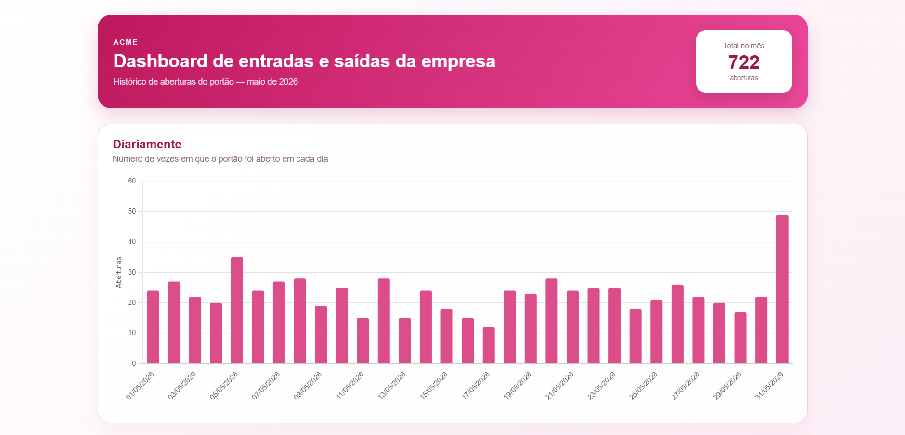
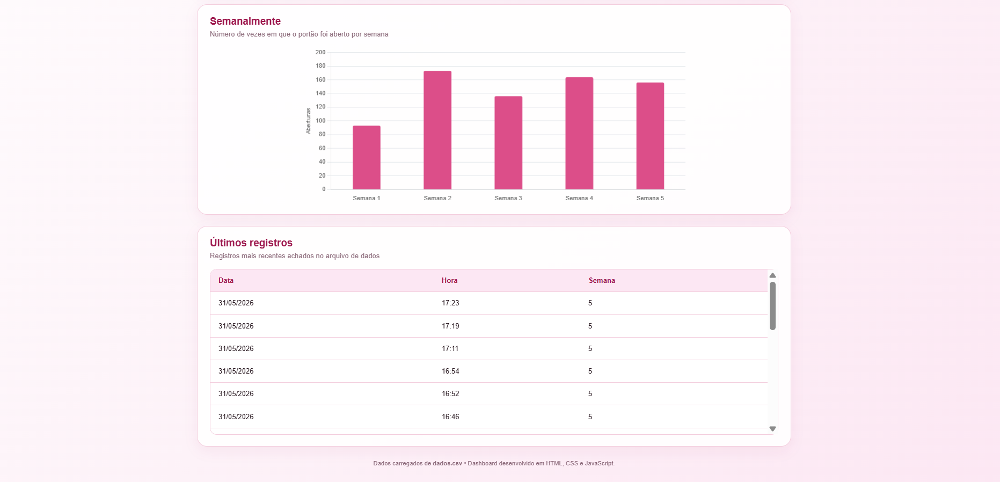
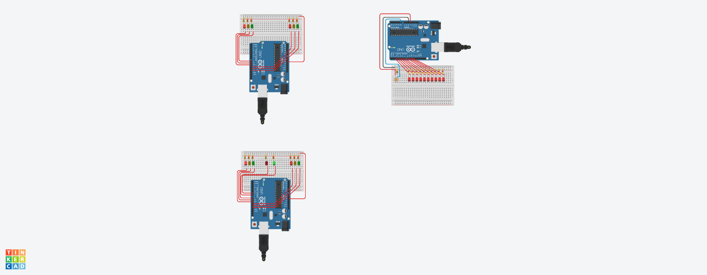
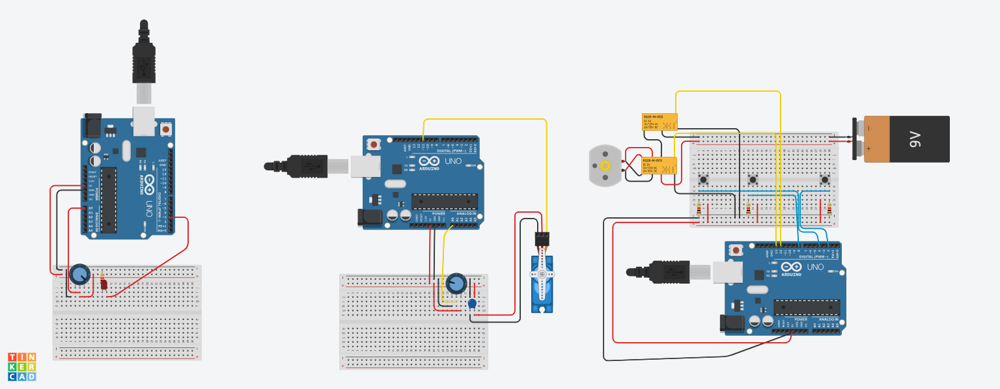
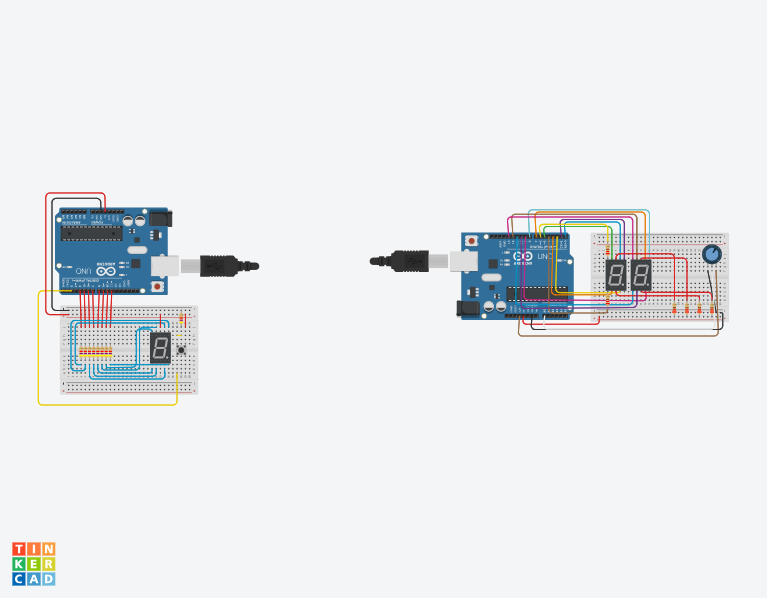

# Dashboard - IOT

## Tecnologias
- HTML5
- CSS3
- JavaScript
- Chart.js

## Arquivos
- ```index.html``` — estrutura da interface.
- ```style.css``` — estilos e responsividade.
- ```script.js``` — leitura do CSV, agrupamento dos dados e criação dos gráficos.
- ```dados.csv``` — dados fornecidos para o desafio.

## Passo a passo
Como o JavaScript usa fetch() para ler o CSV, abra o projeto por um servidor local. No VS Code, a forma mais simples é instalar a extensão Live Server e clicar em: Open with Live Server

link para acessar: https://moniquebabler.github.io/deshborad_portao/

## Web



# Atividades — Tinkercad

Este repositório contém as atividades práticas das aulas 02, 03 e 04, com foco em eletrônica (Tinkercad) e desenvolvimento web (HTML, CSS, JavaScript e manipulação de dados (CSV)).

# Aula 02
### Simulação 01 - Trabalhando com mais alguns componentes
Montagem de um circuito que simula um poste automático. O LDR identifica a luminosidade e controla o LED por meio de um transistor. No escuro, o LED acende; com mais luz, ele diminui ou apaga.

## Simulação 02 - Cricuito simples com interruptor e dois leds
Circuito com bateria de 9 V, interruptor, dois LEDs e resistores. O interruptor controla o funcionamento dos LEDs.

## Simulação 03 - Circuito utilizando capacitor para causar um atraso na troca dos LEDs
Montagem de um sinalizador de garagem com transistor, capacitor, LEDs e resistores. O capacitor cria um atraso na mudança entre as luzes.
## Atividade
Reprodução do sinalizador utilizando Arduino UNO, seguindo o código fornecido para alternar os LEDs.

### Código

```
int verde = 8;
int vermelho = 2;

void setup()
{
  pinMode(verde, OUTPUT);
  pinMode(vermelho, OUTPUT);
}

void loop()
{
  digitalWrite(verde, 1);
  digitalWrite(vermelho, 0);
  delay(1000);
  digitalWrite(verde, 0);
  digitalWrite(vermelho, 1);
  delay(1000);
}
```
### Imagem do Tinkercad


---
# Aula 03
### Situação Problema 01 — Semáforo de duas vias
Criação de dois semáforos controlados por um Arduino UNO, organizando o trânsito e evitando que os dois sinais fiquem verdes ao mesmo tempo. Também foram incluídos LEDs para representar a travessia de pedestres.
### Código

```
const int verdeE = 8;
const int amareloE = 9;
const int vermelhoE = 10;

const int verdeD = 13;
const int amareloD = 12;
const int vermelhoD = 11;

void setup() {
  pinMode(verdeE, OUTPUT);
  pinMode(amareloE, OUTPUT);
  pinMode(vermelhoE, OUTPUT);
  pinMode(verdeD, OUTPUT);
  pinMode(amareloD, OUTPUT);
  pinMode(vermelhoD, OUTPUT);
}

void loop() {
  digitalWrite(verdeE, HIGH);
  digitalWrite(amareloE, LOW);
  digitalWrite(vermelhoE, LOW);

  digitalWrite(verdeD, LOW);
  digitalWrite(amareloD, LOW);
  digitalWrite(vermelhoD, HIGH);

  delay(5000);

  digitalWrite(verdeE, LOW);
  digitalWrite(amareloE, HIGH);
  delay(2000);
  digitalWrite(amareloE, LOW);

  digitalWrite(vermelhoE, HIGH);
  digitalWrite(vermelhoD, HIGH);
  delay(2000);

  digitalWrite(vermelhoE, HIGH);
  digitalWrite(verdeD, HIGH);
  digitalWrite(amareloD, LOW);
  digitalWrite(vermelhoD, LOW);
  delay(5000);

  digitalWrite(verdeD, LOW);
  digitalWrite(amareloD, HIGH);
  delay(2000);
  digitalWrite(amareloD, LOW);

  digitalWrite(vermelhoE, HIGH);
  digitalWrite(vermelhoD, HIGH);
  delay(2000);
}
```

---
### Situação Problema 02 - Acendendo as luzes da pista de pouso
Simulação de uma pista de pouso iluminada por 10 LEDs. Um LDR mede a luminosidade e ajusta a quantidade de LEDs acesos: quanto mais escuro, mais LEDs ficam ligados.
### Código
```
const int ldrPin = A0;

const int leds[] = {2, 3, 4, 5, 6, 7, 8, 9, 10, 11};

void setup() {
  for (int i = 0; i < 10; i++) {
    pinMode(leds[i], OUTPUT);
  }
  pinMode(ldrPin, INPUT);
}

void loop() {
  int luz = analogRead(ldrPin);

  int numLeds = map(luz, 0, 1023, 10, 0);

  for (int i = 0; i < 10; i++) {
    if (i < numLeds) {
      digitalWrite(leds[i], HIGH);
    } else {
      digitalWrite(leds[i], LOW);
    }
  }

  delay(100);
}
```
---
### Desafio Farol de Pedestre
Adição de um semáforo para pedestres ao circuito. A luz verde é ativada quando os dois semáforos de veículos estão vermelhos, permitindo uma travessia mais segura.
### Código
```
const int verdeE = 8;
const int amareloE = 9;
const int vermelhoE = 10;

const int verdeD = 13;
const int amareloD = 12;
const int vermelhoD = 11;

const int verdePed = 7;
const int vermelhoPed = 6;

void setup() {
  pinMode(verdeE, OUTPUT);
  pinMode(amareloE, OUTPUT);
  pinMode(vermelhoE, OUTPUT);
  pinMode(verdeD, OUTPUT);
  pinMode(amareloD, OUTPUT);
  pinMode(vermelhoD, OUTPUT);
  pinMode(verdePed, OUTPUT);
  pinMode(vermelhoPed, OUTPUT);
}

void loop() {
  digitalWrite(verdeE, HIGH);
  digitalWrite(amareloE, LOW);
  digitalWrite(vermelhoE, LOW);

  digitalWrite(verdeD, LOW);
  digitalWrite(amareloD, LOW);
  digitalWrite(vermelhoD, HIGH);

  digitalWrite(verdePed, LOW);
  digitalWrite(vermelhoPed, HIGH);
  delay(5000);

  digitalWrite(verdeE, LOW);
  digitalWrite(amareloE, HIGH);
  delay(2000);
  digitalWrite(amareloE, LOW);

  digitalWrite(vermelhoE, HIGH);
  digitalWrite(vermelhoD, HIGH);
  digitalWrite(verdePed, HIGH);
  digitalWrite(vermelhoPed, LOW);
  delay(4000);
  digitalWrite(verdePed, LOW);
  digitalWrite(vermelhoPed, HIGH);

  digitalWrite(vermelhoE, HIGH);
  digitalWrite(verdeD, HIGH);
  digitalWrite(amareloD, LOW);
  digitalWrite(vermelhoD, LOW);
  delay(5000);

  digitalWrite(verdeD, LOW);
  digitalWrite(amareloD, HIGH);
  delay(2000);
  digitalWrite(amareloD, LOW);

  digitalWrite(vermelhoE, HIGH);
  digitalWrite(vermelhoD, HIGH);
  digitalWrite(verdePed, HIGH);
  digitalWrite(vermelhoPed, LOW);
  delay(4000);
  digitalWrite(verdePed, LOW);
  digitalWrite(vermelhoPed, HIGH);
}
```
### Imagem do Tinkercad



---

# Aula 04
### Experimento 01 - Micro Servo e Potenciômetro
Circuito com Micro Servo e potenciômetro de 1 kΩ. O giro do potenciômetro altera o ângulo do servo entre 0° e 180°.
### Código
```
#include <Servo.h>
int potenc = 0; 
Servo servo; 

void setup(){
  servo.attach(11); 
} 


void loop(){ 
    

  potenc = analogRead(0); 
  

  int angulo = map(potenc, 0, 1023, 0, 180); 
  

  servo.write(angulo); 

} 
```
---
### Experimento 02 - Display de 7 segmentos

Montagem de um contador de 0 a 9 com Arduino UNO, display de 7 segmentos e botão. Cada toque aumenta o número e, após o 9, a contagem volta para 0.
### Código
```
int a = 4, b = 5, c = 6, d = 7, e = 8, f = 9, g = 10;
int botao = 2;
int num = 0;
int entrada[7] = {a,b,c,d,e,f,g};
int display[10][7] = {{a,b,c,d,e,f},{b,c},{a,b,d,e,g},{a,b,c,d,g},{b,c,f,g},{a,c,d,f,g},{a,c,d,e,f,g},{a,b,c},{a,b,c,d,e,f,g},{a,b,c,f,g}};
void setup() {
	for(int i=0;i<7;i++) pinMode(entrada[i],OUTPUT);
	pinMode(botao,INPUT);
}
void loop() {
	int click = digitalRead(botao);
	delay(100); 
	if(click) num++;
	if(num < 10) numero(num); else num = 0;
}
void numero(int coluna) {
	for(int i=0;i<7;i++) digitalWrite(entrada[i],1);
	for(int linha=0;linha<7;linha++){
		digitalWrite(display[coluna][linha],0);
	}
}
```
---

### Desafio - Display com Potenciômetro e Dois Displays

O botão foi substituído por um potenciômetro, permitindo selecionar números de 0 a 9. Depois, foi adicionado um segundo display para representar valores de 00 a 99.
### Código
```
const int segmentos[] = {2, 3, 4, 5, 6, 7, 8};

const int displayDezena = 9;
const int displayUnidade = 10;

const int potenciometro = A0;

// Números de 0 a 9
// A, B, C, D, E, F, G
const byte numeros[10][7] = {
  {1, 1, 1, 1, 1, 1, 0}, // 0
  {0, 1, 1, 0, 0, 0, 0}, // 1
  {1, 1, 0, 1, 1, 0, 1}, // 2
  {1, 1, 1, 1, 0, 0, 1}, // 3
  {0, 1, 1, 0, 0, 1, 1}, // 4
  {1, 0, 1, 1, 0, 1, 1}, // 5
  {1, 0, 1, 1, 1, 1, 1}, // 6
  {1, 1, 1, 0, 0, 0, 0}, // 7
  {1, 1, 1, 1, 1, 1, 1}, // 8
  {1, 1, 1, 1, 0, 1, 1}  // 9
};

void setup() {
  for (int i = 0; i < 7; i++) {
    pinMode(segmentos[i], OUTPUT);
  }

  pinMode(displayDezena, OUTPUT);
  pinMode(displayUnidade, OUTPUT);

  digitalWrite(displayDezena, LOW);
  digitalWrite(displayUnidade, LOW);
}
void mostrarNumero(int numero) {

  for (int i = 0; i < 7; i++) {
    digitalWrite(segmentos[i], numeros[numero][i]);
  }

}

void loop() {
  int leitura = analogRead(potenciometro);

  int valor = map(leitura, 0, 1023, 0, 99);

  int dezena = valor / 10;
  int unidade = valor % 10;

  digitalWrite(displayUnidade, LOW);

  mostrarNumero(dezena);

  digitalWrite(displayDezena, HIGH);

  delay(5);

  digitalWrite(displayDezena, LOW);

  digitalWrite(displayDezena, LOW);

  mostrarNumero(unidade);

  digitalWrite(displayUnidade, HIGH);

  delay(5);

  digitalWrite(displayUnidade, LOW);
}
```
### Imagem do Tinkercad




---